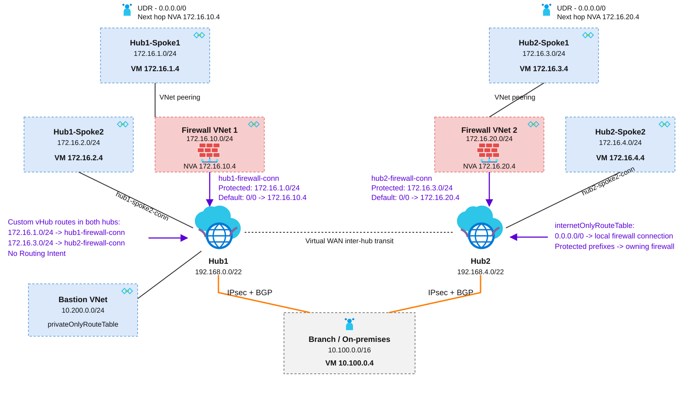

# Azure Virtual WAN BGP: Inter-Hub Spoke NVA Routing

This Bicep lab recreates the four-spoke, one-branch Azure Virtual WAN topology using FRR NVA and native BGP.

## Routing Design

Each region contains one protected Spoke 1 VNet, one directly connected Spoke 2 VNet, and two FRR NVAs in a dedicated transit VNet behind an internal Standard HA Ports load balancer.

| Hub | Protected spoke | Direct spoke | NVA peers | NVA ASN | Advertised prefix | ILB frontend |
|---|---|---|---|---|---|---|
| Hub 1 | `hub1-spoke1` / `172.16.1.0/24` | `hub1-spoke2` / `172.16.2.0/24` | `172.16.10.4`, `172.16.10.5` | `65020` | `172.16.1.0/24` | `172.16.10.10` |
| Hub 2 | `hub2-spoke1` / `172.16.3.0/24` | `hub2-spoke2` / `172.16.4.0/24` | `172.16.20.4`, `172.16.20.5` | `65020` | `172.16.3.0/24` | `172.16.20.10` |

The deployment creates four native `Microsoft.Network/virtualHubs/bgpConnections` resources. Each virtual hub peers with both NVAs in its local transit VNet. FRR receives the virtual hub router IPs at deployment time and advertises only the local protected-spoke prefix.

| Connection | Associated route table | Routing behavior |
|---|---|---|
| Protected Spoke 1 VNets | Not vHub-connected; peered to local NVA transit VNet | Workload subnet default UDR targets the local HA Ports frontend |
| NVA transit VNet connections | Local `defaultRouteTable` | Carries the regional BGP peers and protected-spoke advertisement |
| Direct Spoke 2 VNets | Local Virtual WAN route tables | Retains native vHub associations and propagations |
| Branch VPN | Connected to both virtual hubs | ASN `65010`; four IPsec connections across redundant gateway instances |
| Bastion VNet | Hub 1 private route table | Private routes with internet security disabled |

Protected spoke subnets disable BGP route propagation and send `0.0.0.0/0` to the regional load-balancer frontend. Bidirectional VNet peerings allow forwarded traffic between each protected spoke and its NVA transit VNet. The shared `branch1` VNet (`10.100.0.0/16`) establishes BGP/IPsec connectivity to both virtual hubs.

FRR enables IPv4 forwarding, disables reverse-path filtering, resolves multihop next hops through Azure's default route, preserves RFC1918 source addresses on private paths, performs NAT for internet traffic, assigns the ILB frontend `/32` to loopback, and serves the TCP health probe on port `8080`.

**Selective cross-hub routing remains unresolved.** The source-equivalent TCP/22 matrix passed 16 of 20 directions. All four protected-Spoke1-to-remote-Spoke2 directions failed, matching the predecessor lab; all other branch, same-hub, protected-to-protected, and direct-Spoke2 paths passed.

## Architecture

The diagram shows the protected Spoke 1 VNets, dedicated NVA transit VNets, directly connected Spoke 2 VNets, and dual-connected branch.



## Prerequisites

### Requirements

- **PowerShell 7+** — Run the deployment script with `pwsh`. Windows PowerShell 5.1 is not supported.
- **Azure Subscription** — An active Azure subscription with sufficient quota for the resources deployed
- **RBAC role at subscription scope** — **Contributor** is sufficient; **Owner** also works. Resource-group-only access is not sufficient because the subscription-scoped template creates the resource group.
- **Azure CLI with Bicep support** — The deployment script invokes `az deployment sub create`
- Logged in to Azure CLI. When deploying to another tenant, specify its tenant ID or verified domain during login:
  ```powershell
  az login --tenant "<TENANT_ID_OR_DOMAIN>"
  ```

### Required Resource Providers

The subscription must have these resource providers registered:

- `Microsoft.Network`
- `Microsoft.Compute`

The default deployment includes nine Linux VMs, two `/22` virtual hubs, two virtual hub VPN gateways, one branch VPN gateway, two internal load balancers, and one Standard Bastion host.

## Getting Started

### Clone the Repository

```powershell
git clone https://github.com/colinweiner111/azure-vwan-interregion-nva-bgp-routing-lab.git
cd azure-vwan-interregion-nva-bgp-routing-lab
```

## Deployment

Use the PowerShell deployment script:

```powershell
.\deploy-bicep.ps1 -SubscriptionId <subscription-id> -ResourceGroupName <your-rg-name> -Location westus3 -Location2 centralus
```

Example:
```powershell
.\deploy-bicep.ps1 -SubscriptionId 00000000-0000-0000-0000-000000000000 -ResourceGroupName vwan-interregion-nva-bgp-test01 -Location westus3 -Location2 centralus
```

The script will:
1. Select and verify the exact subscription supplied with `-SubscriptionId`
2. Refuse an existing resource group unless `-ResumeExisting` is explicitly supplied
3. Deploy the subscription-scoped Bicep template, which creates the resource group
4. Prompt securely for the VM admin password and VPN pre-shared key if not provided

> **Use a fresh resource group.** `-ResumeExisting` is only for a deliberately reviewed, isolated deployment created from this lab. Never target the source lab or an unrelated resource group.

## Default Configuration

- **Username**: `azureuser`
- **Password**: Prompted during deployment (set a strong password)
- **Regions**: Both hubs in `westus3` by default; pass `-Location2 centralus` for an inter-region deployment
- **VM Size**: `Standard_D2ls_v7`
- **NVA ASN**: `65020`
- **Branch ASN**: `65010`
- **vHub ASN**: `65515`
- **VPN pre-shared key**: Prompted during deployment

## Validation

The configuration passed local Bicep compilation, compiled-template routing checks, deployment to `vwan-interregion-nva-bgp-lab-v3`, FRR and VPN control-plane checks, a complete TCP/22 and internet test, and single-NVA failover.

### Intra-hub paths

| Path | Result |
|---|---|
| Hub 1 Spoke 1 -> NVA -> Hub 1 -> Hub 1 Spoke 2 | PASS |
| Hub 1 Spoke 2 -> Hub 1 -> NVA -> Hub 1 Spoke 1 | PASS |
| Hub 2 Spoke 1 -> NVA -> Hub 2 -> Hub 2 Spoke 2 | PASS |
| Hub 2 Spoke 2 -> Hub 2 -> NVA -> Hub 2 Spoke 1 | PASS |

### Branch paths

| Path | Result |
|---|---|
| Branch -> Hub 1 protected and direct spokes | PASS |
| Hub 1 protected and direct spokes -> Branch | PASS |
| Branch -> Hub 2 protected and direct spokes | PASS |
| Hub 2 protected and direct spokes -> Branch | PASS |

### Inter-hub paths

| Path | Result |
|---|---|
| Hub 1 protected Spoke 1 <-> Hub 2 protected Spoke 1 | PASS |
| Hub 1 direct Spoke 2 <-> Hub 2 direct Spoke 2 | PASS |
| Hub 1 protected Spoke 1 <-> Hub 2 direct Spoke 2 | FAIL |
| Hub 2 protected Spoke 1 <-> Hub 1 direct Spoke 2 | FAIL |

### Internet paths

| Path | Result |
|---|---|
| Hub 1 protected and direct spokes -> internet | PASS |
| Hub 2 protected and direct spokes -> internet | PASS |

### NVA failover

Stopping `hub1-nva1` left both BGP sessions on `hub1-nva2` established. Hub 1 protected-spoke traffic to the branch, local direct spoke, and internet continued successfully. After restoration, both BGP sessions on `hub1-nva1` returned to `Established`.

Successful connectivity alone does not prove the intended NVA path. Correlate effective routes, BGP learned and advertised routes, load-balancer health, FRR state, and packet or flow evidence before claiming symmetry or failover.

## Credits & Source

- Daniel Mauser, [`inter-region-nvabgp`](https://github.com/dmauser/azure-virtualwan/tree/main/inter-region-nvabgp) — architecture inspiration.
- The predecessor Virtual WAN lab — repository structure, deployment safeguards, README format, and source diagram style.
- [BGP peering with a Virtual WAN hub](https://learn.microsoft.com/azure/virtual-wan/scenario-bgp-peering-hub) — Microsoft documentation.

---

© MIT Licensed. See `LICENSE`.
