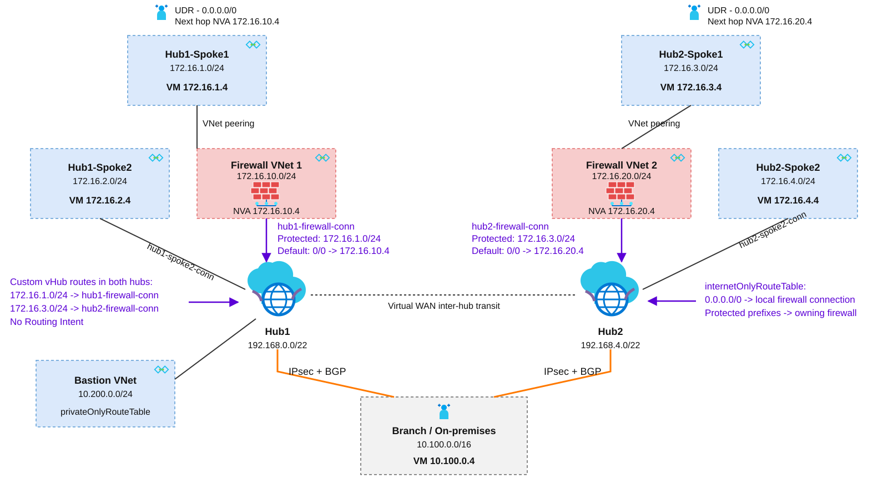

# Azure Virtual WAN BGP: Inter-Hub Spoke NVA Routing



*Topology reference from the predecessor lab. Its Azure Firewall labels and static protected-prefix routes do not represent this FRR/BGP deployment; use the routing details below for the current design.*

This Bicep lab demonstrates native Azure Virtual WAN BGP peering with Linux/FRR NVAs, protected and direct spokes, branch connectivity, and internet egress. It is a routing lab, not a stateful firewall deployment.

## Architecture and Routing

Each hub has one protected Spoke 1 VNet, one directly connected Spoke 2 VNet, and two FRR NVAs in a transit VNet behind an internal Standard HA Ports load balancer. Both hubs default to `westus3`.

| Hub | Protected spoke | Direct spoke | NVA peers | NVA ASN | Advertised prefix | ILB frontend |
|---|---|---|---|---|---|---|
| Hub 1 | `hub1-spoke1` / `172.16.1.0/24` | `hub1-spoke2` / `172.16.2.0/24` | `172.16.10.4`, `172.16.10.5` | `65020` | `172.16.1.0/24` | `172.16.10.10` |
| Hub 2 | `hub2-spoke1` / `172.16.3.0/24` | `hub2-spoke2` / `172.16.4.0/24` | `172.16.20.4`, `172.16.20.5` | `65020` | `172.16.3.0/24` | `172.16.20.10` |

This is a **BGP-based NVA lab with static traffic-steering routes**, not a static-only lab:

- **BGP:** Each NVA peers with both local vHub router IPs and originates its protected-spoke prefix. Hub-to-protected-spoke traffic uses individual NVA BGP next hops, not static protected-prefix routes to the ILB.
- **Spoke UDRs:** Protected spokes are not directly connected to a hub; they peer with their local transit VNet, allow forwarded traffic, and disable subnet BGP route propagation. Their `0.0.0.0/0` UDR targets the local ILB.
- **Internet steering:** Direct spokes retain a static default through the local NVA connection to its ILB. Linux NAT and the transit-subnet NAT Gateway provide internet egress.
- **Branch and management:** `branch1` (`10.100.0.0/16`, ASN `65010`) connects to both hubs using BGP/IPsec. Bastion connects through Hub 1's private route table with internet security disabled.

**Routing invariant:** Each NVA transit connection associates with the local `defaultRouteTable` and propagates to the same `default`, `internet-only`, and `private-only` labels as the VPN connection. Both default tables retain Azure's internal `default` label and also carry `private-only`, explicitly joining the cross-hub private-route propagation group.

The [FRR/Linux configuration](scripts/configure-frr-nva.sh) enables IPv4 forwarding, disables reverse-path filtering, resolves multihop next hops through Azure's default route, preserves private source addresses, NATs internet traffic, assigns the ILB frontend `/32` to loopback, and serves the TCP health probe on port `8080`.

## Prerequisites

- **PowerShell 7+** — Run the deployment script with `pwsh`. Windows PowerShell 5.1 is not supported.
- **Azure subscription** with sufficient quota for the resources deployed.
- **RBAC role at subscription scope** — **Contributor** is sufficient; **Owner** also works. Resource-group-only access is not sufficient because the subscription-scoped template creates the resource group.
- **Azure CLI with Bicep support** — The deployment script invokes `az deployment sub create`.
- Logged in to Azure CLI. When deploying to another tenant, specify its tenant ID or verified domain during login:
  ```powershell
  az login --tenant "<TENANT_ID_OR_DOMAIN>"
  ```
- Register the **`Microsoft.Network`** and **`Microsoft.Compute`** resource providers.

The default deployment includes nine Linux VMs, two `/22` virtual hubs, two virtual hub VPN gateways, one branch VPN gateway, two internal load balancers, and one Standard Bastion host.

## Deploy

Clone the repository:

```powershell
git clone https://github.com/colinweiner111/azure-vwan-interregion-nva-bgp-routing-lab.git
cd azure-vwan-interregion-nva-bgp-routing-lab
```

Run from PowerShell 7, replacing the subscription ID and choosing a **new** resource-group name:

```powershell
.\deploy-bicep.ps1 -SubscriptionId "<subscription-id>" -ResourceGroupName "vwan-interregion-nva-bgp-test01"
```

This uses `westus3` for both hubs. To deploy hubs in different regions, specify a second region, for example `-Location2 centralus`.

The script will:
1. Select and verify the exact subscription supplied with `-SubscriptionId`
2. Refuse an existing resource group unless `-ResumeExisting` is explicitly supplied
3. Deploy the subscription-scoped Bicep template, which creates the resource group
4. Prompt securely for the VM admin password and VPN pre-shared key if not provided

> **Use a fresh resource group.** `-ResumeExisting` is only for a deliberately reviewed, isolated deployment created from this lab. Never target the source lab or an unrelated resource group.

### Defaults

| Setting | Value |
|---|---|
| VM username / size | `azureuser` / `Standard_D2ls_v7` |
| Hub regions | `westus3` / `westus3` |
| NVA / branch / vHub ASN | `65020` / `65010` / `65515` |
| VM password / VPN pre-shared key | Prompted securely during deployment |

## Validate

Run local Bicep compilation and compiled-template routing regression checks with:

```powershell
pwsh -File .\tests\Test-Routing.ps1
```

These checks verify NVA/VPN propagation alignment, default-table association, absence of protected-prefix static overrides, and preservation of the local internet defaults. They do not test Azure route convergence or connectivity.

Private traffic may use different NVAs in each direction; this is expected for stateless FRR forwarding.

## Credits & Source

- Daniel Mauser, [`inter-region-nvabgp`](https://github.com/dmauser/azure-virtualwan/tree/main/inter-region-nvabgp) — architecture inspiration.
- The predecessor Virtual WAN lab — repository structure, deployment safeguards, and source diagram style.
- [BGP peering with a Virtual WAN hub](https://learn.microsoft.com/azure/virtual-wan/scenario-bgp-peering-hub) — Microsoft documentation.

---

© MIT Licensed. See [LICENSE](LICENSE).
